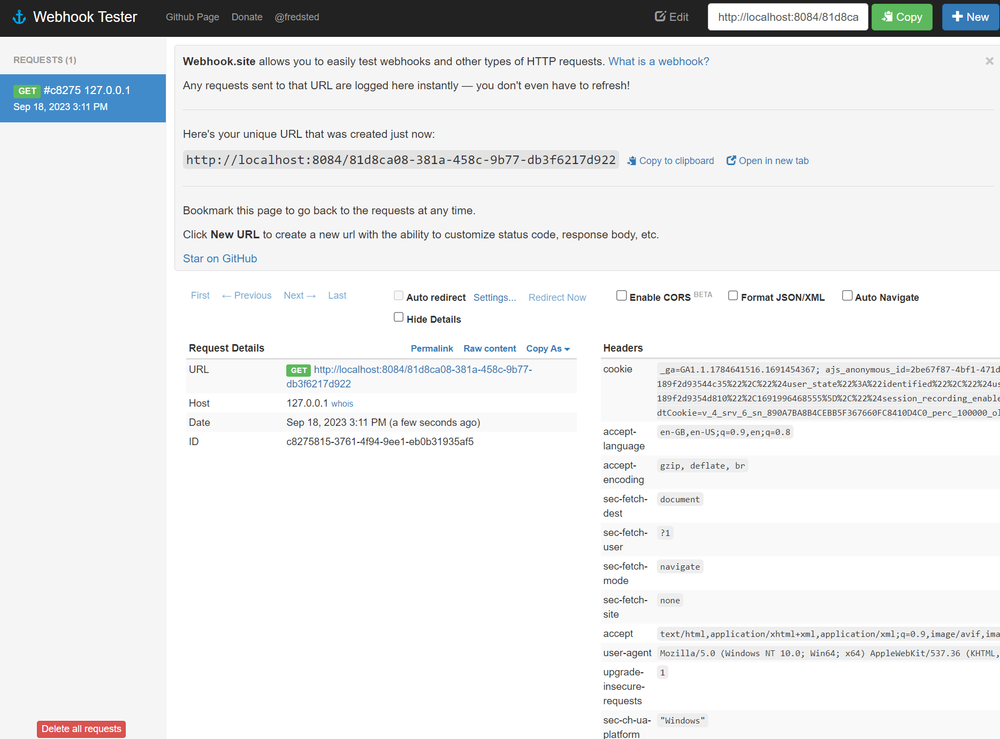

# Release Lifecycle Management

The Release Lifecycle Management tools run
pre- and post-deployment tasks and checks
for your existing cloud-native deployments
to make them more robust.
This tutorial introduces these tools.

> This tutorial assumes you have already completed the
[Getting started with Keptn Observability](../getting-started/index.md)
exercise.
> Please ensure you've finished that before attempting this guide.

## Keptn Pre and Post Deployment Tasks

When Keptn is successfully monitoring your deployments, it can also run arbitrary tasks and SLO evaluations:

- pre-deployment (before the pod is scheduled) and
- post-deployment (after the post is scheduled)

> Pre and post deployments can also run on a KeptnApp level.
> See [annotations to KeptnApp](../guides/integrate.md#annotations-to-keptnapp)

## Prerequisites: Deploy webhook sink

During this exercise, you will configure Keptn to trigger a webhook before and after a deployment has successfully completed.

For demo purposes, a place is required to send those request.
Install the [open source webhook.site tool](https://github.com/webhooksite/webhook.site/tree/master/kubernetes) now.

This will provide a place, on cluster, to send (and view) web requests.

> Note: If you have your own endpoint, you can skip this step.

```shell
kubectl apply -f https://raw.githubusercontent.com/webhooksite/webhook.site/master/kubernetes/namespace.yml
kubectl apply -f https://raw.githubusercontent.com/webhooksite/webhook.site/master/kubernetes/redis.deployment.yml
kubectl apply -f https://raw.githubusercontent.com/webhooksite/webhook.site/master/kubernetes/laravel-echo-server.deployment.yml
kubectl apply -f https://raw.githubusercontent.com/webhooksite/webhook.site/master/kubernetes/webhook.deployment.yml
kubectl apply -f https://raw.githubusercontent.com/webhooksite/webhook.site/master/kubernetes/service.yml
```

Wait until all pods are running in the `webhook` namespace then port-forward and view the webhook sink page:

```shell
kubectl -n webhook wait --for=condition=Ready pods --all
kubectl -n webhook port-forward svc/webhook 8084
```

Open a browser and go to `http://localhost:8084`

You should see a page like this with a unique URL (your ID will be different).


Make a note of that unique URL.

### Verify Webhook Sink

Open a new browser table and go to your unique URL.
The page should remain blank, but when toggling back to `http://localhost:8084`, you should see a new entry.

Every request sent to that unique URL will be logged here.



## Add a Post Deployment Task

Add a task which will trigger after a deployment.

Change `UUID` to whatever value you have.
Apply this manifest:

```yaml
