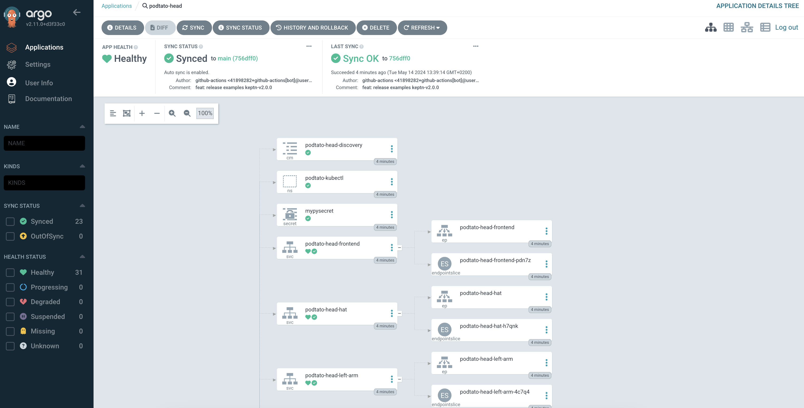
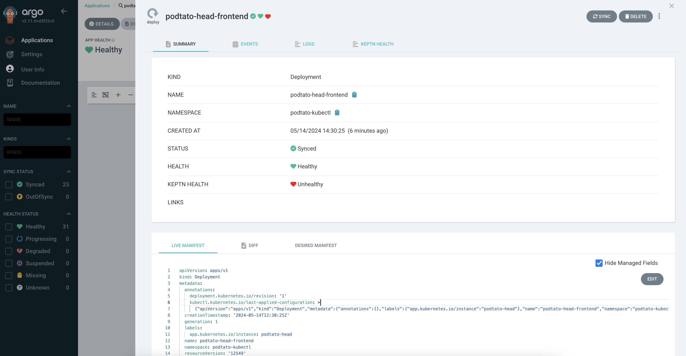

# Application health checks with Keptn using ArgoCD

In this blog post we will present a planned Keptn and
[ArgoCD](https://argo-cd.readthedocs.io/en/stable/) integration to execute
advanced application health checks using Keptn.

Keptn provides an effective way to perform application health checks using the
pre- or post-deployment [tasks](https://keptn.sh/stable/docs/guides/tasks/)
and [evaluations](https://keptn.sh/stable/docs/guides/evaluations/).
ArgoCD application health checks evaluate whether the application is successfully deployed
and the workloads are running on the cluster
but they do not show if the services
of a single application are actually working as expected.
For example, it could be the case that the individual services deployed by ArgoCD are up and
running, but due to a slow `response time` (let's say `3s`), the users would have a bad experience.
Keptn pre- and post-deployment tasks and evaluations complement the missing functionality
by providing a straight-forward way to examine the application's ability to perform
the actions for which it was developed.
In this particular case, Keptn can perform `KeptnEvaluations` to examine whether the `response time`
of the application services are in the expected boundaries.

<!-- more -->

## How it's going to work?

Keptn and ArgoCD need to be installed and enabled on the same
cluster.
To install both components, you can follow the
[Keptn installation instructions](https://keptn.sh/stable/docs/installation/)
and
[ArgoCD installation instructions](https://argo-cd.readthedocs.io/en/stable/operator-manual/installation/).
The reason is that we want to have ArgoCD perform the actual deployment
of the application and Keptn execute the advanced application health checks.

Additionally, we will need to have an ArgoCD extension, which consists of
a React application extending the ArgoCD UI, implemented as  an
[ArgoCD UI Application Tab Extension](https://argo-cd.readthedocs.io/en/stable/developer-guide/extensions/ui-extensions/#application-tab-extensions)
and a
[ArgoCD proxy extension](https://argo-cd.readthedocs.io/en/stable/developer-guide/extensions/proxy-extensions/)
allowing Keptn (which will work as a backend service)
to push the application health status data to the ArgoCD UI.

## What's the added value of Keptn?

Let's try to show a real-life example of an application deployed via ArgoCD,
which has a healthy green status in ArgoCD UI, but it's not working as expected
due to a slow `response time` of the application.

We will deploy a simple [podtato-head](https://github.com/podtato-head/podtato-head)
application via ArgoCD, which consists of multiple Deployments and Services.
The Argo Application deploying the manifests can look like the following:

```yaml

```

After a few moments, the `podtato-head` application is successfully deployed and all pods
are running.


We can also examine the ArgoCD UI and everything seems to be working as expected and the
`podtato-head` application is healthy.



Let's now try to add some health checks of the `podtato-head` application
and use Keptn to execute them.
For this, we are going to use the
[Keptn Release Lifecycle Management](https://keptn.sh/stable/docs/getting-started/lifecycle-management/)
feature and perform the checks via `KeptnEvaluations`.

Apart from `KeptnEvaluations`, `KeptnTasks` can be used to execute health checks
of an application as well, for example performing an HTTP request to test
the reachability of a certain service exposed on a configured port.

For simplicity, we assume that you already have a data source
(such as Prometheus, Dynatrace, or Datadog)
deployed and configured as a metrics provider on your cluster.
This data provider can fetch the `response time` values
of the services.
In our setup, we are going to use [Prometheus](https://prometheus.io/).

First, we need to create [KeptnMetric](https://keptn.sh/stable/docs/reference/crd-reference/metric/)
and [KeptnMetricsProvider](https://keptn.sh/stable/docs/reference/crd-reference/metricsprovider/)
resources in our cluster.
These two resources contain a simple query for fetching the `response time` of the `podtato-head`
application service and configuration for the metrics provider supplying the data.

```yaml

```

Next, we add `KeptnEvaluationDefinition` into our git repository, where our
`podtato-head` application lives.
It defines the [SLO](https://www.dynatrace.com/news/blog/what-are-slos/)
by linking the existing `KeptnMetric` resource and providing the rule the value should fullfil.

```yaml

```

Additionally, we annotate the `podtato-head-frontend` Deployment to execute
the evaluation as part of `post-deployment-evaluation` checks.

```yaml

```

After these two changes are made in our git repository, ArgoCD will see changes and re-trigger
the deployment of `podtato-head`.
Keptn waits until all of the
application pods are running and then it executes `post-deployment-evaluation` evaluations.

Due to slow `response time` of the `podtato-head-frontend` service, the
executed `KeptnEvaluation` fails.

Here we see that Keptn lets us perform more advanced health checks
(tasks or evaluations) and verify that the application deployed via ArgoCD is healthy.
Like `KeptnEvaluations`, `KeptnTasks` can be executed as part of a quality health check
for our application.

## How to show Keptn health status in ArgoCD UI?

Using Keptn together with ArgoCD brings a lot of value, which we saw in the previous section,
but observing application health status by inspecting the status of the
various resources using `kubectl` is not the best user experience.
The data should be nicely displayed in the ArgoCD UI to provide the user with an overview
of whether the application was deployed successfully, if it's synchronized, and if it's healthy, all in
one place.

To implement this, we are going to implement an ArgoCD UI extension with additional application health
data that are retrieved from Keptn.
This way, the ArgoCD UI will act as a single source of truth for the user, providing all
the information about the deployed application.

Below you can see the first mock-ups that show what the ArgoCD UI extension might look like
and how a failed `KeptnEvaluation` and therefore unhealthy Keptn status of `podtato-head-frontend`
Deployment might be displayed on the main ArgoCD UI screen.


Additionally, it should be possible to also examine the details of the unhealthy
application and potentially see the reason for the failure of the checks.



## Summary

Time to sum up what we have presented in this blog post.
We have seen how Keptn can easily complement ArgoCD
and enhance its functionality by providing more insights into
application health status.
We showed an example where ArgoCD wasn't able to detect that
the deployed application is not healthy and used `KeptnEvaluations`
for performing more advanced checks.
In the end, we looked at the first drafts of the potential
ArgoCD UI extension and how it can easily display the
`Keptn health status` as part of the standard ArgoCD application
health status.

We hope that this blog post gives you an idea and some inspiration
on how these two projects can cooperate and complement each other
effectively in order to support continuous delivery of applications
faster and more reliably.

We would really appreciate if you can provide us feedback on this
feature below in the comments!

## Useful links

- <https://keptn.sh>
- <https://argo-cd.readthedocs.io/en/stable/>
- <https://prometheus.io/>
