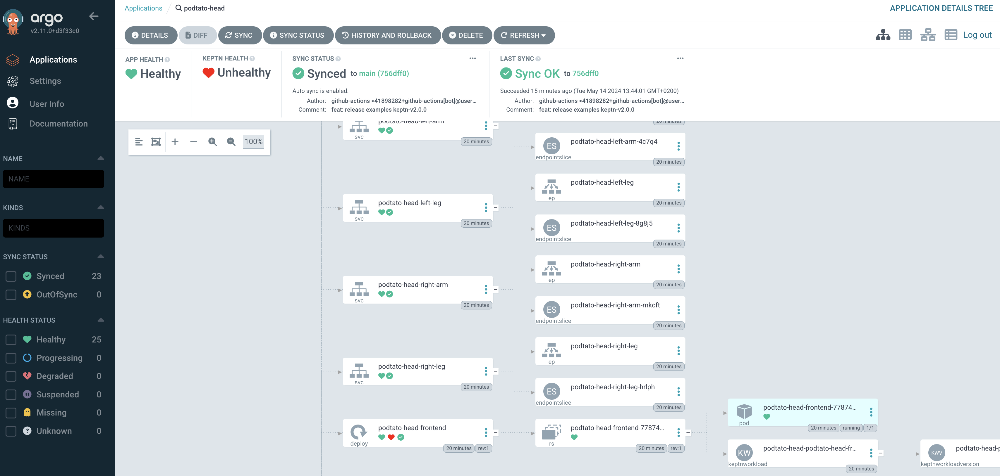

# Application health checks with Keptn using ArgoCD

In this blogpost we will present a planned Keptn and
[ArgoCD](https://argo-cd.readthedocs.io/en/stable/) integration to execute
application health checks using Keptn, where the application itself is deployed
by ArgoCD, and display the Keptn application health status via ArgoCD UI.

Keptn provides an effective way to perform application health checks using the
pre- or post-deployment tasks and evaluations.
Compared to ArgoCD application
health checks, which are evaluating if the application is successfully deployed
and the workloads are running on the cluster, they do not show if the microservices
of a single application are able to communicate and cooperate with each other.
Keptn pre- and post-deployment tasks and evaluations complement the missing functionality
by providing a straight-forward way to examine the application ability to perform
actions for which it was developed to do.

<!-- more -->

## How it's going to work?

The integration of Keptn and ArgoCD performing and displaying full application
health checks is not fully implemented yet, but
we can have a brief look how it might work in the future.

First of all, Keptn and ArgoCD need to be installed and enabled on the same
cluster.
The reason is we need to have ArgoCD performing the actual deployment
of the application and Keptn performing the advanced application health checks.

Additionally, we will need to install an ArgoCD extension, which will consist of
React application extending the ArgoCD UI, implemented as
[ArgoCD UI Application Tab Extension](https://argo-cd.readthedocs.io/en/stable/developer-guide/extensions/ui-extensions/#application-tab-extensions)
and a proxy allowing Keptn (which will work as a backend service)
to push the application health status data to the ArgoCD UI.
For proxy setup, the
[ArgoCD proxy extension](https://argo-cd.readthedocs.io/en/stable/developer-guide/extensions/proxy-extensions/)
will be used.

## What's the added value of Keptn?

Let's try to show a real-life example of an application deployed via ArgoCD,
which has a healthy green status in ArgoCD UI, but it's not working as expected
due to an internal error of the application.

We will deploy a simple podtato-head application, which consists of multiple
Deployments and Services via ArgoCD.
The Argo Application deploying the manifests looks like the following:

```yaml

```

After a few moments, the `podtato-head` application is successfully deployed and all pods
are running.


We can also check the ArgoCD UI and everything seems to be working as expected and the
`podtato-head` application is healthy.


Let's now try to add some additional health checks of the `podtato-head` application
and use Keptn to execute them.
For this we are going to use the
[Keptn Release Lifecycle Management](https://keptn.sh/stable/docs/getting-started/lifecycle-management/)
feature and perform the health checks via `KeptnTasks`.

First we need to add `KeptnTaskDefinition` into our GitOps repository, where our
`podtato-head` application lives.
It defines a simple check of reachability of one of the `podtato-head` application
services and confirms that this service is available.

```yaml

```

Additionally, we need to annotate the `podtato-head-frontend` Deployment to execute
the task as part of `post-deployment` checks.

```yaml

```

After these two changes are made in our GitOps repository, we can restart the deployment
of `podtato-head` application.
After the restart, ArgoCD will re-deploy the application, Keptn waits until all of the
application pods are running and executes `post-deployment` tasks.

Due to misconfiguration of the `podtato-head-frontend` Deployment, the service is deployed on
port `8080` instead of `8081` as it's expected by the task.
The executed `KeptnTask` therefore fails.

Here we can see that with the use of Keptn we can execute more advanced health checks
(tasks or evaluations) and verify that the application is healthy during the process
of deployment which is performed by ArgoCD.

## How to show Keptn health status in ArgoCD UI?

Using Keptn together with ArgoCD brings a lot of value, which we saw in the previous section,
but looking on application health status in the cluster is not the best user experience.
The data should be nicely displayed in the ArgoCD UI to provide the user an overview
if the application was deployed, if it's synchronized and if it's healthy, all in
one place.

Due to this reason, we are going to enhance ArgoCD UI with additional application health
data, which are retrieved from Keptn.
This way, the ArgoCD UI will act as a single source of truth for the user providing all
the information about the deployed application.

Below you can see the first mockups how the extension of ArgoCD UI might look like
and how a failed `KeptnTask` and therefore unhealthy Keptn status of `podtato-head-frontend`
Deployment might be displayed on the main ArgoCD UI screen.



Additionally, it will be possible to examine also the details of the unhealthy
microservice and potentially reason of the failure of the checks.


## Summary

Time to sum up what we have learned in this blog post.
We have seen how Keptn can easily complement ArgoCD
and enhance its functionality by providing more insights into
application health status.
We showed an example where ArgoCD wasn't able to detect that
the deployed application is not healthy and used `KeptnTasks`
for performing more advanced checks.
In the end, we looked at the first drafts of the potential
ArgoCD UI extension and how it can easily display the
`Keptn health status` as part of the standard ArgoCD application
health status.

We hope that this blog post gives you an idea and some inspiration
on how there two projects can cooperate and complement each other
effectively in order to support continuous delivery of applications
more reliable and faster.

## Useful links

- <https://keptn.sh>
- <https://argo-cd.readthedocs.io/en/stable/>
