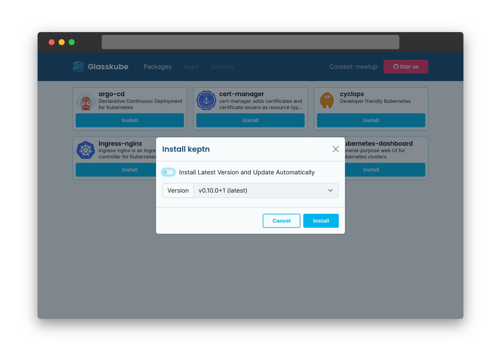
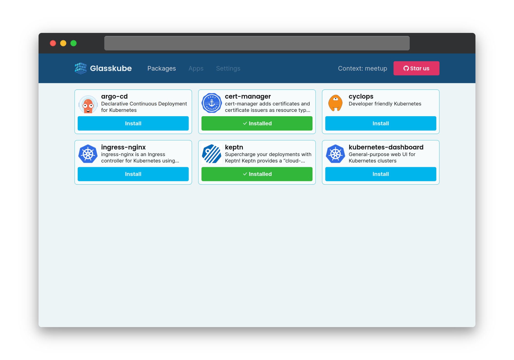

# Keptn is now officially available via the Glasskube Package Manager for Kubernetes

We are happy to announce that Keptn is now officially available via the Glasskube Package Manager to bring Keptn
to even more users.

Installing packages for Kubernetes clusters is one of the most pressing issues in the Cloud Native community.
There are still some unaddressed challenges like managing dependencies and streamlining updates across multiple
packages.

In this article we give an overview about Glasskube, Keptn and how the installation works.

<!-- more -->

## What is Glasskube?

[Glasskube](https://glasskube.dev) is the next generation package manager for Kubernetes and part of the CNCF
landscape.

Inspired by traditional package managers like `brew`, `apt` or `dnf`, Glasskube allows users to easily find, install
and update packages for Kubernetes.
Glasskube packages are dependency aware, so if multiple packages require for
example cert-manager, it only gets installed once in the recommended namespace and can then be utilized by multiple packages.
Glasskube not only provides a streamlined CLI experience, but also a simple UI for managing Kubernetes packages.
Glasskube itself is designed as a Cloud Native application and every installed package is represented by a
Custom Resource.
This comes in handy if packages and Glasskube itself should be managed via a GitOps approach.

[`glasskube/glasskube`](https://github.com/glasskube/glasskube/) is in active development, with _good first issues_
available for new contributors.

## What is Keptn?

[Keptn](https://keptn.sh/) is a CNCF project for continuous delivery and automated operations.
It helps developers and platform engineering teams automate deployment, monitoring, and management of applications
running in cloud environments.
Keptn works with standard deployment software like ArgoCD or Flux, consolidating metrics, observability, and analysis
for all the microservices that comprise your deployed software as well as providing checks and executables that can
run before and/or after the deployment.

## Keptn package on Glasskube

The supported Keptn versions and packages can be found in the Glasskube package repository:
[`glasskube/packages/keptn`](https://github.com/glasskube/packages/tree/main/packages/keptn)

As Keptn requires a certificate in order to interact with the Kubernetes API it can either make use of cert-manager.io
or it alternatively packages its own certificate manager.
In the Glasskube package yaml there is a dependency on `cert-manager` configured:

```yaml
name: "keptn"
shortDescription: >-
  Supercharge your deployments with Keptn! Keptn provides a “cloud-native” approach for managing the application
  release lifecycle metrics, observability, health checks, with pre- and post-deployment evaluations and tasks.
iconUrl: "https://raw.githubusercontent.com/cncf/artwork/main/projects/keptn/icon/color/keptn-icon-color.svg"
defaultNamespace: "keptn-system"
manifests:
  - url: https://glasskube.github.io/packages/packages/keptn/v2.0.0-rc.1+1/keptn.yaml
  - url: https://glasskube.github.io/packages/packages/keptn/v2.0.0-rc.1+1/keptn-cert.yaml
  - url: https://glasskube.github.io/packages/packages/keptn/v2.0.0-rc.1+1/keptn-issuer.yaml
dependencies:
  - name: "cert-manager"
```

## Installation of Keptn with Glasskube

### Install Glasskube

If you haven't already installed the `glasskube` client you can install it either via `brew` or follow the
[Glasskube Documentation](https://glasskube.dev/docs/getting-started/install/).

```shell
brew install glasskube/tap/glasskube
```

After installing Glasskube, you can bootstrap Glasskube with `glasskube bootstrap` or perform an automatic
bootstrap with your first package installation.

### Keptn installation with the Glasskube CLI

You simply install Keptn with:

```shell
glasskube install keptn
```

After the installation you can validate that all components have been installed by running by executing:

```shell
kubectl get all -n keptn-system
```

### Keptn installation with the Glasskube GUI

Glasskube provides an easy way to install Keptn with a graphical user interface.

#### 1. Open the Glasskube GUI with

The first step is to open the Glasskube GUI with the `serve` command.

```shell
glasskube serve
```

#### 2. Install Keptn via the web browser

Your default web browser will open on [http://localhost:8580](http://localhost:8580).


Where you just need to click the "Install" Button for Keptn.



You can also choose if you want to enable automatic updates or install a specific version.

#### 3. Validate Keptn installation

After some time the Glasskube GUI automatically updates the state of the installed package.



After the installation you can validate that all components have been installed executing:

```shell
kubectl get all -n keptn-system
```

## Summary

Keptn is now officially available via the Glasskube Package Manager and can easily be installed and updated via a CLI,
GUI or GitOps solutions like ArgoCD or FluxCD.

## Useful links

- <https://glasskube.dev/>
- <https://helm.sh/>
- <https://github.com/glasskube/glasskube/>
- <https://github.com/glasskube/packages/>
