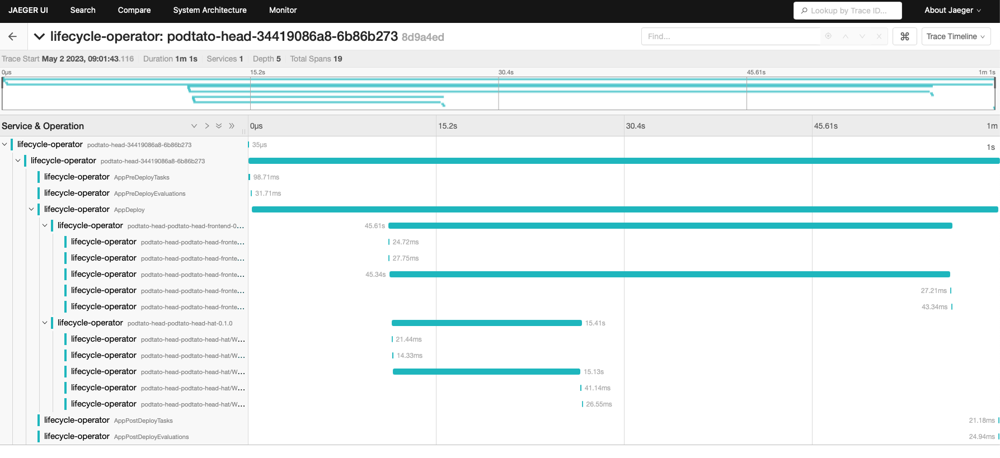

Use Kubernetes annotations and labels
to integrate the Keptn Lifecycle Toolkit into your Kubernetes cluster.

The Keptn Lifecycle Toolkit monitors resources
that have been applied into the Kubernetes cluster
and reacts if it finds a workload with special annotations/labels.
This is a four-step process:

* [Enable the target namespace](#enable-target-namespace)
* [Annotate your workload(s)](#annotate-workloads)
* Define a Keptn application that references those workloads.
  You have two options:

  * [Define Keptn custom resources](#define-keptn-custom-resources-for-the-application)
    for the application
  * [Use the Keptn automatic app discovery capability](#use-keptn-automatic-app-discovery)
    that enables the observability features provided by the Lifecycle Toolkit
    for existing applications,
    without requiring you to manually create any KeptnApp resources.

## Enable target namespace

To enable the Keptn Lifecycle Controller in your cluster,
annotate the Kubernetes
[Namespace](https://kubernetes.io/docs/concepts/overview/working-with-objects/namespaces/);
for example:

```yaml
apiVersion: v1
kind: Namespace
metadata:
  name: simplenode-dev
  annotations:
    keptn.sh/lifecycle-toolkit: "enabled"
```

This annotation tells the webhook to handle the namespace.

## Annotate workload(s)

To annotate your
[Workload](https://kubernetes.io/docs/concepts/workloads/),
you need to set annotations in your Kubernetes
[Deployment](https://kubernetes.io/docs/concepts/workloads/controllers/deployment/) CRD.

Note that you do not need to explicitly create a `KeptnWorkload`.
KLT monitors your `Deployments`,
[StatefulSets](https://kubernetes.io/docs/concepts/workloads/controllers/statefulset/),
and
[ReplicaSets](https://kubernetes.io/docs/concepts/workloads/controllers/replicaset/),
and
[DaemonSets](https://kubernetes.io/docs/concepts/workloads/controllers/daemonset/)
in the namespaces where KLT is enabled.
If KLT finds any of hese CRDs and the CRD has either
the keptn.sh or the kubernetes recommended labels,
it creates a `KeptnWorkload` resource for the version it detects.

### Basic annotations

The basic keptn.sh annotations are:

```yaml
keptn.sh/app: myAwesomeAppName
keptn.sh/workload: myAwesomeWorkload
keptn.sh/version: myAwesomeWorkloadVersion
```

Alternatively, you can use Kubernetes
[Recommended Labels](https://kubernetes.io/docs/concepts/overview/working-with-objects/common-labels/)
to annotate your workload:

```yaml
app.kubernetes.io/part-of: myAwesomeAppName
app.kubernetes.io/name: myAwesomeWorkload
app.kubernetes.io/version: myAwesomeWorkloadVersion
```

Note the following:

* The Keptn Annotations/Labels take precedence
  over the Kubernetes recommended labels.
* If the Workload has no version annotation/labels
  and the pod has only one container,
  the Lifecycle Toolkit takes the image tag as version
  (if it is not "latest").

This process is demonstrated in the
[Keptn Lifecycle Toolkit: Installation and KeptnTask Creation in Mintes](https://www.youtube.com/watch?v=Hh01bBwZ_qM)
video.

### Pre- and post-deployment checks

Further annotations are necessary
to run pre- and post-deployment checks:

```yaml
keptn.sh/pre-deployment-tasks: verify-infrastructure-problems
keptn.sh/post-deployment-tasks: slack-notification,performance-test
```

The value of these annotations are
Keptn [CRDs](https://kubernetes.io/docs/concepts/extend-kubernetes/api-extension/custom-resources/)
called `KeptnTaskDefinition`s.
These resources contain re-usable "functions"
that can execute before and after the deployment.
In this example, before the deployment starts,
a check for open problems in your infrastructure is performed.
If everything is fine, the deployment continues and afterward,
a slack notification is sent with the result of the deployment
and a pipeline to run performance tests is invoked.
Otherwise, the deployment is kept in a pending state
until the infrastructure is capable of accepting deployments again.

A more comprehensive example can be found in our
[examples folder](https://github.com/keptn/lifecycle-toolkit/tree/main/examples/sample-app),
where we use [Podtato-Head](https://github.com/podtato-head/podtato-head)
to run some simple pre-deployment checks.

To run the example, use the following commands:

```shell
cd ./examples/podtatohead-deployment/
kubectl apply -f .
```

Afterward, you can monitor the status of the deployment using

```shell
kubectl get keptnworkloadinstance -n podtato-kubectl -w
```

The deployment for a Workload stays in a `Pending`
state until the respective pre-deployment check is successfully completed.
Afterwards, the deployment starts and when the workload is deployed,
the post-deployment checks start.

## Define a Keptn application

  You have two options:

* Create a [KeptnApp](../../yaml-crd-ref/app.md) resource
    that references the workloads that should be included
    along with any
    [KeptnTaskDefinition](../../yaml-crd-ref/taskdefinition.md)
    and [KeptnEvaluationDefinition](../../yaml-crd-ref/evaluationdefinition.md)
    CRDs that you want
* Use the Keptn automatic app discovery capability
    that enables the observability features provided by the Lifecycle Toolkit
    for existing applications,
    without requiring you to manually create any KeptnApp resources

### Define Keptn custom resources for the application

Create a [KeptnApp](../yaml-crd-ref/app.md) resource
that references the workloads that should be included
along with any
[KeptnTaskDefinition](../yaml-crd-ref/taskdefinition.md)
and [KeptnEvaluationDefinition](../yaml-crd-ref/evaluationdefinition.md)
CRDs that you want

TODO: provide more details

### Use Keptn automatic app discovery

The Keptn Lifecycle Toolkit provides the option
to automatically discover `KeptnApp`s,
based on the recommended Kubernetes labels `app.kubernetes.io/part-of`,
`app.kubernetes.io/name` `app.kubernetes.io/version`.
Because of the OpenTelemetry tracing features
provided by the Keptn Lifecycle Toolkit,
this enables the observability features for existing applications,
without creating any Keptn-related custom resources.

To enable the automatic discovery of `KeptnApp`s for your existing applications,
the following steps are required:

1. Enable KLT for the namespace where your application runs
   following the instructions above
1. Make sure the following Kubernetes labels and/or annotations are present
   in the pod template specs of your Workloads
   (`Deployments`, `StatefulSets`, `DaemonSets`, and `ReplicaSets`)
   within your application:

    * `app.kubernetes.io/name`: Determines the name
       of the generated `KeptnWorkload` representing the Workload.
    * `app.kubernetes.io/version`: Determines the version
       of the `KeptnWorkload` representing the Workload.
    * `app.kubernetes.io/part-of`: Determines the name
       of the generated `KeptnApp` representing your Application.

       All Workloads that share the same value for this label
       are consolidated into the same `KeptnApp`.

As an example, consider the following application,
consisting of several deployments,
which is going to be deployed into a KLT-enabled namespace:

```yaml
apiVersion: v1
kind: Namespace
metadata:
  name: podtato-kubectl
  annotations:
    keptn.sh/lifecycle-toolkit: "enabled"

---
apiVersion: apps/v1
kind: Deployment
metadata:
  name: podtato-head-frontend
  namespace: podtato-kubectl
spec:
  template:
    metadata:
      labels:
        app.kubernetes.io/name: podtato-head-frontend
        app.kubernetes.io/part-of: podtato-head
        app.kubernetes.io/version: 0.1.0
    spec:
      containers:
        - name: podtato-head-frontend
          image: podtato-head-frontend
---
apiVersion: apps/v1
kind: Deployment
metadata:
  name: podtato-head-hat
  namespace: podtato-kubectl
spec:
  replicas: 1
  template:
    metadata:
      labels:
        app.kubernetes.io/name: podtato-head-hat
        app.kubernetes.io/part-of: podtato-head
        app.kubernetes.io/version: 0.1.1
    spec:
      containers:
        - name: podtato-head-hat
          image: podtato-head-hat
```

Applying these resources results in the creation
of the following `KeptnApp` resource:

```yaml
apiVersion: lifecycle.keptn.sh/v1alpha2
kind: KeptnApp
metadata:
  name: podtato-head
  namespace: podtato-kubectl
  annotations:
    app.kubernetes.io/managed-by: "klt"
spec:
  version: "<version string based on a hash of all containing workloads>"
  workloads:
  - name: podtato-head-frontend
    version: 0.1.0
  - name: podtato-head-hat
    version: 1.1.1
```

With the `KeptnApp` resource created,
you get observability of your application's deployments
by using the OpenTelemetry tracing features
that are provided by the Keptn Lifecycle Toolkit:


