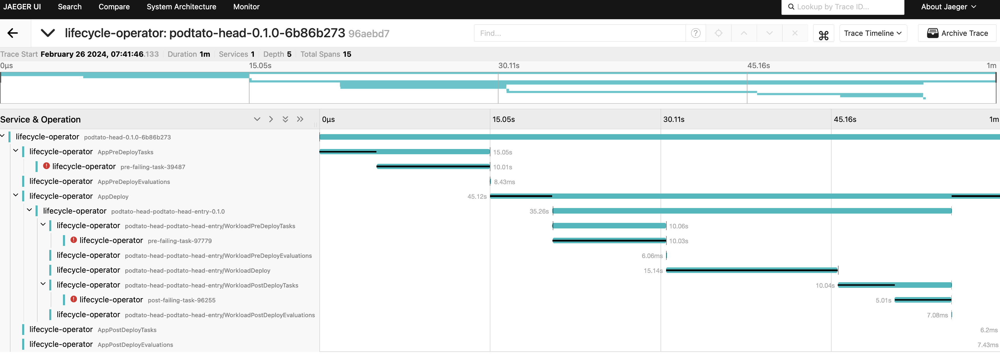

# Keptn non-blocking deployment functionality

Keptn provides an option to disable the default deployment blocking functionality
when pre-deployment tasks or evaluations (on KeptnApp or KeptnWorkload level) fail.
By creating a [KeptnConfig](../../reference/crd-reference/config.md) resources and
setting the `.spec.blockDeployment` parameter of to `false` the blocking
behavior for Keptn is disabled and therefore all applications will get deployed
to the cluster whether the pre-deployment tasks or evaluations fail.

This behavior is valuable if you want to execute a dry-run of the
tasks/evaluations for the application, but still have your application deployed
to the cluster not depending on the results of the pre-checks.

If the checks of the application fail, the state of the deployment phase
are marked as `Warning` and you are able to inspect which
of the checks has failed.

```yaml

```

Additionally, you are still able
to inspect the traces of your application deployment.
The failed checks are marked and visible in the traces.


