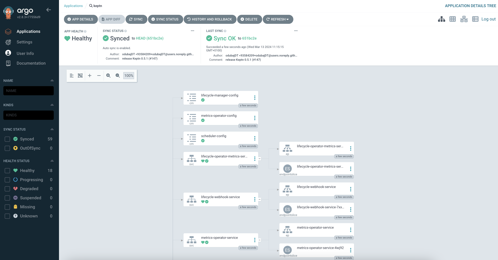

# Deploy Keptn via ArgoCD

Keptn can be deployed on your Kubernetes cluster
via [ArgoCD](https://argo-cd.readthedocs.io/en/stable/).
To be able to do that, you need to have ArgoCD installed
on your cluster.
You can find the
[installation instructions](https://argo-cd.readthedocs.io/en/stable/operator-manual/installation/)
in the ArgoCD documentation.

After successfully installing ArgoCD, you need to create
an Argo Application custom resource and define the
repository containing Keptn helm charts:

```yaml

```

After applying the Application to your cluster,
Argo will fetch the state of the linked repository
and deploy the content via helm.

You can access ArgoCD UI to see that
Keptn is up and running



> **Note**
Please be aware, that you need to enable
[cascading deletion](https://kubernetes.io/docs/concepts/architecture/garbage-collection/#cascading-deletion)
of the application, which is disabled by default in ArgoCD.
You can enable it by adding the deletion finalizers into your
Argo Application, like it's done in the example above.
More information about the deletion finalizers can be found
[here](https://argo-cd.readthedocs.io/en/stable/user-guide/app_deletion/#about-the-deletion-finalizer).

```yaml
metadata:
  finalizers:
    - resources-finalizer.argocd.argoproj.io # enabling cascading deletion
```
