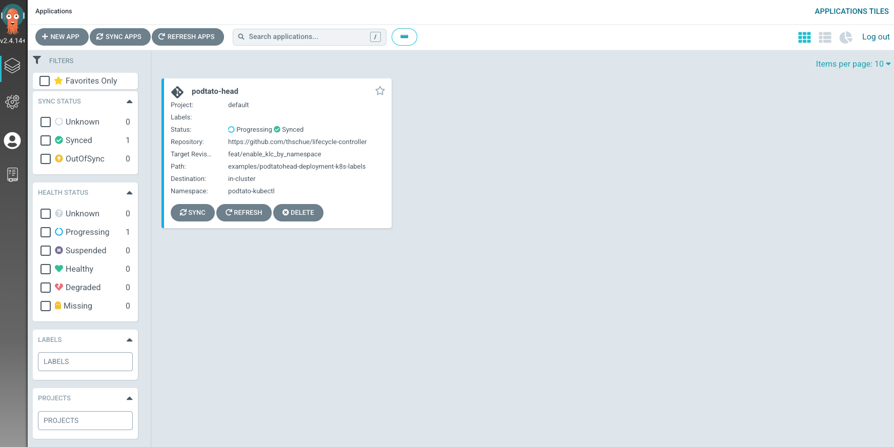

# Deploying an application using the Keptn Lifecycle Controller and ArgoCD

In this example, we will show you how to install our sample application *podtatohead* using the Keptn Lifecycle Controller and [ArgoCD](https://argo-cd.readthedocs.io/en/stable/).

# TL;DR
* You can install ArgoCD using: `make install`
* Afterward, you can fetch the secret for the ArgoCD CLI using: `make argo-get-password`
* Then you can port-forward the ArgoUI using: `make argo-port-forward`
  * Alternatively, you can access Argo using the CLI, configure it using `make argo-configure-cli`
* Deploy the PodTatoHead Demo Application: `make argo-install-podtatohead`
  * This will need a slack-secret as described [here](../podtatohead-deployment/README.md#Create-Secret-for-Slack-here)
* Watch the progress on your ArgoUI: `http://localhost:8080`

## Prerequisites:
This tutorial assumes, that you already installed the Keptn Lifecycle Controller (see https://github.com/keptn-sandbox/lifecycle-service). Furthermore, you have to install ArgoCD, as in the following their [installation instructions](https://argoproj.github.io/argo-cd/getting_started/).

### Install ArgoCD
If you don't have an already existing installation of ArgoCD, you can install it using the following commands:
```shell
kubectl create namespace argocd
kubectl apply -n argocd -f https://raw.githubusercontent.com/argoproj/argo-cd/latest/manifests/install.yaml
```

With these commands, ArgoCD will be installed in the `argocd` namespace.

After that, you can find the password for ArgoCD using the following command:
```shell
kubectl -n argocd get secret argocd-initial-admin-secret -o jsonpath="{.data.password}" | base64 -d
```

### Port-Forward ArgoCD and access the UI
To access the ArgoCD UI, you can port-forward the ArgoCD service using the following command:
```shell
kubectl port-forward svc/argocd-server -n argocd 8080:443
```
Then you can access the UI using http://localhost:8080.

## Installing the Demo Application
To install the demo application, you can use the following command:
```shell
kubectl apply -f https://raw.githubusercontent.com/keptn-sandbox/lifecycle-service/main/examples/argo/config/app.yaml
```

You will see that the application will be deployed using ArgoCD. You can watch the progress on the ArgoCD UI and should see the following:


In the meanwhile you can watch the progress of the deployment using:
> `kubectl get pods -n podtato-kubectl`
  * See that the pods are pending until the pre-deployment tasks have passed
  * Pre-Deployment Tasks are started
  * Pods get scheduled

* `kubectl get keptnworkloadinstances -n podtato-kubectl`
  * Get the current status of the workloads
  * See in which phase your workload deployments are at the moment
  
* `kubectl get keptnapplicationversions -n podtato-kubectl`
    * Get the current status of the application
    * See in which phase your application deployment is at the moment
    * You might notice that post-deployment-tasks fail (this is expected, as the secret for the post-deployment task is not available)
    * Therefore, you can create the post-deployment secret using the following command:
      * `kubectl create secret generic slack-notification --from-literal=SECURE_DATA='{"slack_hook":"<WebHook>","text":"Deployed PodTatoHead Application"}' -n podtato-kubectl`

After some time all resources should be in a succeeded state. In the Argo-UI you will see that the application is in sync.
