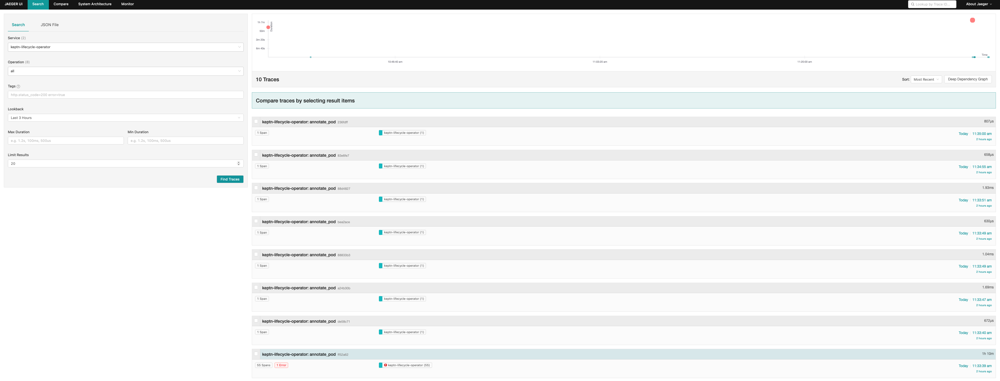
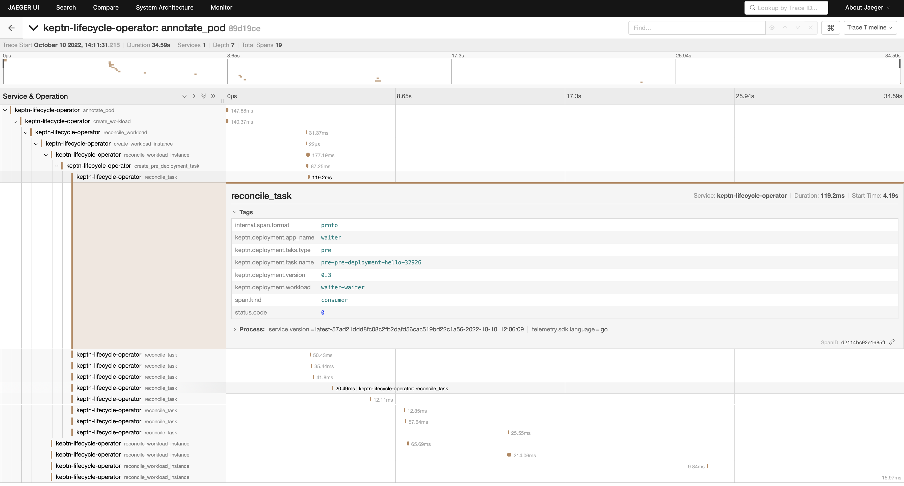
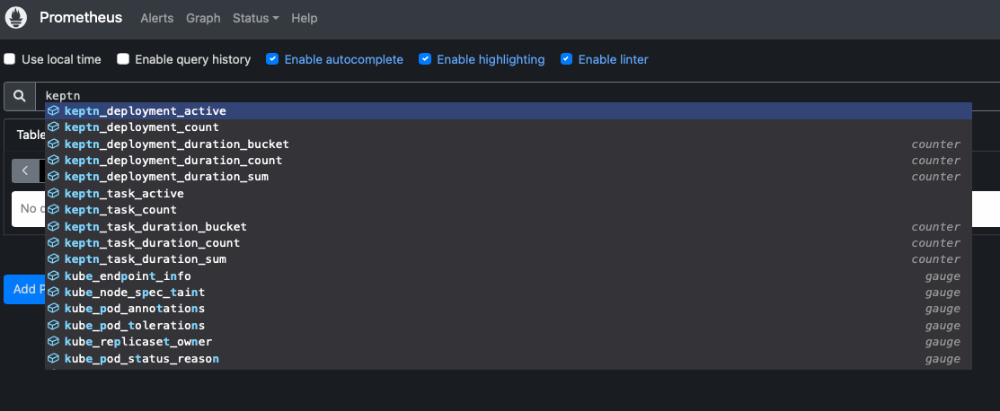
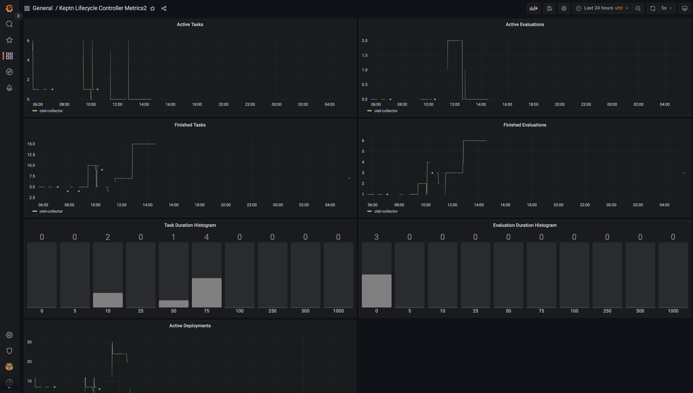

# Sending Traces and Metrics to the OpenTelemetry Collector

In this example, we will show you an example configuration for enabling the operator to send OpenTelemetry traces and metrics to the [OpenTelemetry Collector](https://github.com/open-telemetry/opentelemetry-collector).
The Collector will then be used to forward the gathered data to [Jaeger](https://www.jaegertracing.io) and [Prometheus](https://prometheus.io).
The application deployed uses an example of pre-Deployment Evaluation based on prometheus metrics.

# TL;DR
* You can install the whole demo using: `make install`
* Deploy the PodTatoHead Demo Application: `make deploy-podtatohead`
* Afterward, see it in action as defined here: [OpenTelemetry in Action](#seeing-the-opentelemetry-collector-in-action)

## Prerequisites:
This tutorial assumes, that you already installed the Keptn Lifecycle Controller (see https://github.com/keptn/lifecycle-toolkit). The installation instructions can be found [here](https://github.com/keptn/lifecycle-toolkit#deploy-the-latest-release).
As well, you have both Jaeger and the Prometheus Operator installed in your Cluster. 
Also, please ensure that the Prometheus Operator has the required permissions to watch resources of the `keptn-lifecycle-toolkit-system` namespace (see https://prometheus-operator.dev/docs/kube/monitoring-other-namespaces/ as a reference).
For setting up both Jaeger and Prometheus, please refer to their docs:

- [Jaeger Setup](https://github.com/jaegertracing/jaeger-operator) 
- [Prometheus Operator Setup](https://github.com/prometheus-operator/kube-prometheus/blob/main/docs/customizing.md)

If you don't have an already existing installation of Jaeger [manifest](https://github.com/jaegertracing/jaeger-operator/releases/download/v1.38.0/jaeger-operator.yaml) or Prometheus, you can run these commands to
have a basic installation up and running.

```shell

# Install Jaeger into the observability namespace and the Jaeger resource into the lifecycle-toolkit namespace
kubectl create namespace observability
kubectl apply -f https://github.com/jaegertracing/jaeger-operator/releases/download/v1.38.0/jaeger-operator.yaml -n observability
kubectl apply -f config/jaeger.yaml -n keptn-lifecycle-toolkit-system

# Install Prometheus
kubectl create namespace monitoring
kubectl apply --server-side -f config/prometheus/setup
kubectl apply -f config/prometheus/
```

With these commands, the Jaeger and Prometheus Operator will be installed in the `observability` and `monitoring` namespaces, respectively.

## Configuring the OpenTelemetry Collector and Prometheus ServiceMonitor

Once Jaeger and Prometheus are installed, you can deploy and configure the OpenTelemetry collector using the manifests in the `config` directory:

```sh 
kubectl apply -f config/otel-collector.yaml -n keptn-lifecycle-toolkit-system
```

Also, please ensure that the `OTEL_COLLECTOR_URL` env vars of both the `klc-controller-manager`, 
as well as the `keptn-scheduler` deployments are set appropriately. 
By default, they are set to `otel-collector:4317`, which should be the correct value for this tutorial.

Eventually, there should be a pod for the `otel-collector` deployment up and running:

```sh
$ kubectl get pods -lapp=opentelemetry -n keptn-lifecycle-toolkit-system

NAME                              READY   STATUS    RESTARTS      AGE
otel-collector-6fc4cc84d6-7hnvp   1/1     Running   0             92m
```

If you want to extend the OTel Collector configuration to send your telemetry data to other Observability platform, you
can edit the Collector ConfigMap with the following command:

```shell
kubectl edit configmap otel-collector-conf -n keptn-lifecycle-toolkit-system
```

When the `otel-collector` pod is up and running, restart the `keptn-scheduler` and `klc-controller-manager` so they can
pick up the new configuration.

```shell
kubectl rollout restart deployment -n keptn-lifecycle-toolkit-system keptn-scheduler klc-controller-manager
```

## Seeing the OpenTelemetry Collector in action

After everything has been set up, use the lifecycle operator to deploy a workload (e.g. using the `single-service` or `podtato-head` example in the `examples` folder).
To showcase pre-Evaluation checks we created a new version of podtato-head app in assets/podtetohead-deployment-evaluation.
You can run ``make deploy-podtatohead`` to check pre-Evaluations of prometheus metrics both at app and workload instance level.
Once an example has been deployed, you can view the generated traces in Jaeger. To do so, please create a port-forward for the `jaeger-query` service:

```sh
kubectl port-forward -n keptn-lifecycle-toolkit-system svc/jaeger-query 16686 
```

Afterwards, you can view the Jaeger UI in the browser at [localhost:16686](http://localhost:16686). There you should see the traces generated by the lifecycle controller, which should look like this:

**Traces overview** 



**Trace details**



In Prometheus, do a port forward to the prometheus service inside your cluster (the exact name and namespace of the prometheus service will depend on your Prometheus setup - we are using the defaults that come with the example of the Prometheus Operator tutorial).

```sh
kubectl -n monitoring port-forward svc/prometheus-k8s 9090
```

Afterwards, you can view the Prometheus UI in the browser at [localhost:9090](http://localhost:9090). There, in the [Targets](http://localhost:9090/targets?search=) section, you should see an entry for the otel-collector:


Also, in the [Graph](http://localhost:9090/graph?g0.expr=&g0.tab=1&g0.stacked=0&g0.show_exemplars=0&g0.range_input=1h) section, you can retrieve metrics reported by the Keptn Lifecycle Controller (all of the available metrics start with the `keptn` prefix):



To view the exported metrics in Grafana, we have provided an example dashboard that you can import and view in Grafana. To do so, please first create a port-forward for the `grafana` service in the `monitoring` namespace:

```sh
make port-forward-grafana
```

Afterwards, you can import our example dashboard using the following command:

```sh
make import-grafana-dashboard
```

*Note:* If this command does not work, or if you do not have `curl` installed, you can alternatively import the Dashboard via the Grafana UI, using the file `./assets/grafana_dashboard_import_ui.json`.

After the dashboard has been set up, you should be able to see it in the [Grafana UI](http://localhost:3000/d/wlo2MpIVk/keptn-lifecycle-toolkit-metrics) under `Dashboards > General`.

